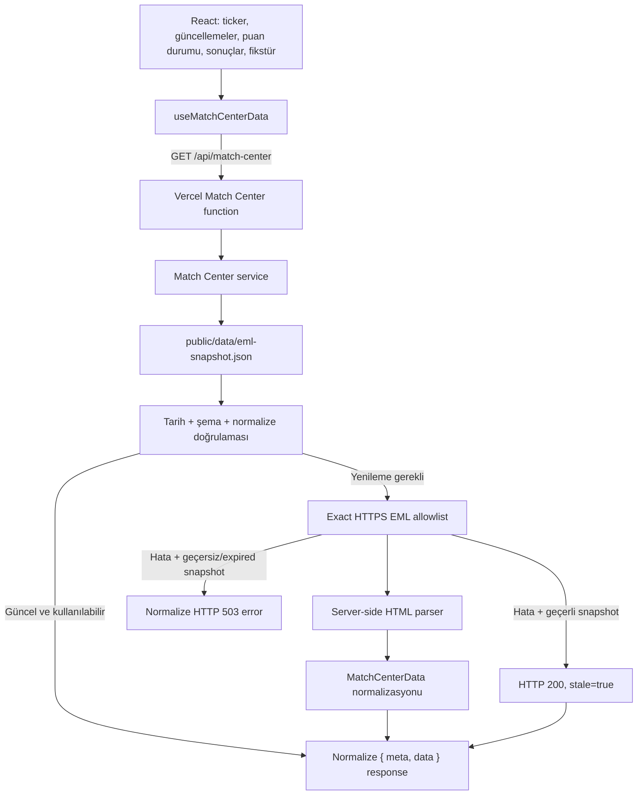
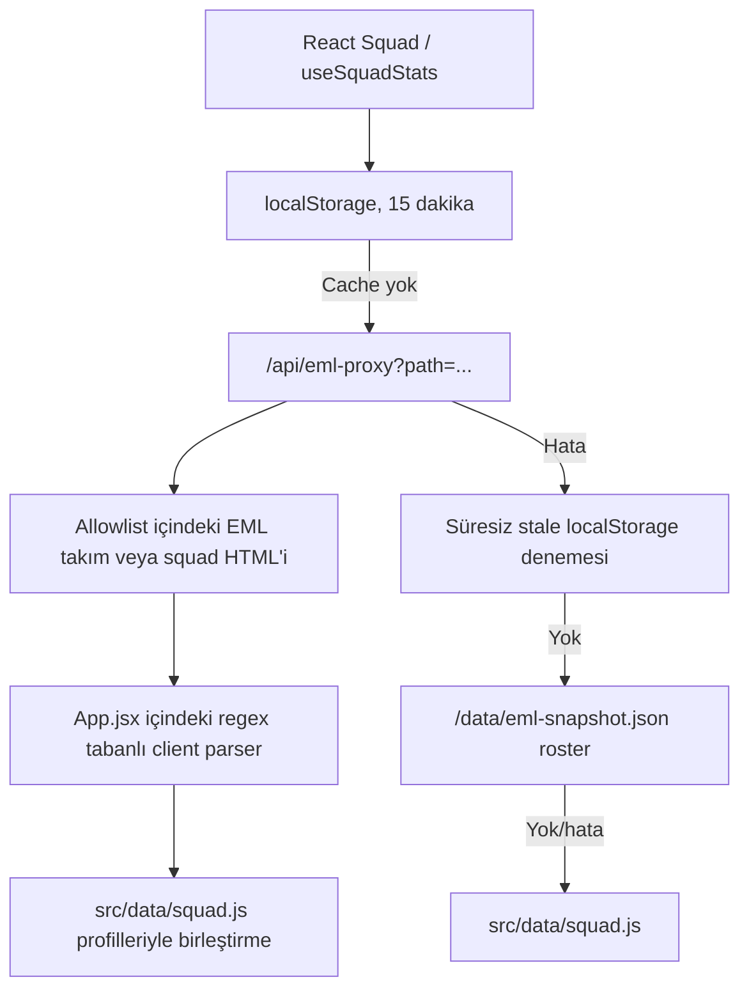

# ALTAIR eSports Site Baseline

> Tarih: 10 Ağustos 2026  
> İncelenen dal: `agent/update-results-fixtures`  
> İncelenen commit: `d14c6ee`  
> Kapsam: Mevcut çalışma ağacının analizidir; üretim davranışı veya görsel tasarım değiştirilmemiştir.

## 1. Baseline kapsamı ve çalışma ağacı

Bu belge commit edilmiş kaynaklarla birlikte çalışma ağacındaki mevcut, henüz commit edilmemiş geliştirmeleri de kapsar. İnceleme başladığında repository temiz değildi. Özellikle Match Center veri modeli, serverless endpoint, snapshot doğrulaması, ilgili testler ve bazı UI çalışmaları çalışma ağacında bulunuyordu. Bu dosyalara analiz amacıyla müdahale edilmedi.

Baseline aşağıdaki alanları kapsar:

- Uygulama ve hosting mimarisi
- Sayfa bölümleri ve sorumlulukları
- Maç, puan durumu ve kadro veri akışları
- Build çıktısı ve statik varlık boyutları
- SEO ve dil mimarisi
- Klavye, semantik, hareket ve kontrast erişilebilirliği
- Sonraki geliştirmeler için güvenli uygulama sırası

## 2. Mevcut mimari

### 2.1 Teknoloji yığını

| Alan | Mevcut durum |
| --- | --- |
| UI framework | React `19.2.4` ve React DOM `19.2.4` |
| Build aracı | Vite `8.0.4`, `@vitejs/plugin-react` `6.0.1` |
| Dil | JavaScript ve JSX; TypeScript kullanılmıyor |
| Paket kilidi | npm lockfile v3 |
| Hosting | Vercel statik hosting + `api/` altındaki serverless fonksiyonlar |
| Router | Yok; ana sayfa hash bağlantılarıyla çalışan tek sayfa uygulaması |
| Test altyapısı | Node.js yerleşik `node:test`; DOM/component/browser test kütüphanesi yok |
| Lint | ESLint 9, React Hooks ve React Refresh kuralları |
| Typecheck | Ayrı bir typecheck komutu veya `tsconfig` yok |
| Analytics | npm analytics paketi yok; Vercel Analytics ve Speed Insights scriptleri production'da dinamik ekleniyor |
| PWA | El yazımı service worker, web manifest ve PWA ikonları var; Workbox yok |

### 2.2 package.json komutları

| Komut | Sorumluluk |
| --- | --- |
| `npm run dev` | Vite geliştirme sunucusu |
| `npm run build` | Vite production build |
| `npm run preview` | Production build önizlemesi |
| `npm run lint` | Tüm JavaScript/JSX dosyalarında ESLint |
| `npm test` | Node test runner ile tüm testler |
| `npm run data:verify` | Match Center snapshot şeması, tarihleri ve bütünlüğü |
| `npm run update:eml-snapshot` | EML maç, puan durumu ve roster snapshot yenilemesi |
| `npm run update:squad-stats` | `src/data/squad.js` içindeki oyuncu istatistiklerini doğrudan güncelleyen ayrı script |

### 2.3 Çalışma zamanı yapısı

- `src/main.jsx`, React uygulamasını `StrictMode` ve sınıf tabanlı `ErrorBoundary` içinde başlatır.
- Ana ekran istemci tarafında render edilir; SSR veya prerender katmanı yoktur.
- `src/App.jsx` uygulama state'inin, navigasyonun, dil kopyalarının, kadro HTML parser'ının ve ana sayfa bölümlerinin çoğunu barındırır.
- Match Center verisi tek internal `/api/match-center` isteği üzerinden gelir.
- Kadro verisi ayrı kalmıştır: client, `/api/eml-proxy` üzerinden ham HTML alır ve parser'ı tarayıcıda çalıştırır.
- Vercel production ortamında serverless fonksiyonları çalıştırır. Local geliştirmede Match Center için Vite middleware, kadro proxy'si için Vite proxy kullanılır.
- Production'da service worker yalnızca sayfa yüklendikten sonra kaydedilir.

### 2.4 Router ve sayfa modeli

React Router veya başka bir router yoktur. Ana içerik tek `/` URL'sinde render edilir. Navigasyon aşağıdaki hash hedeflerini kullanır:

- `#top`
- `#matches`
- `#standings`
- `#fixtures`
- `#squad`
- `#sponsors`
- `#broadcast`

`media-kit.html`, `privacy.html`, `terms.html` ve `404.html` React dışında bağımsız statik sayfalardır.

## 3. Ana dosyalar ve sorumlulukları

| Dosya | Sorumluluk |
| --- | --- |
| `package.json` | Komutlar ve React/Vite/ESLint bağımlılıkları |
| `index.html` | Ana HTML kabuğu, font yükleme, SEO meta etiketleri, JSON-LD ve PWA bağlantıları |
| `src/main.jsx` | React bootstrap, Error Boundary, observability ve service worker kaydı |
| `src/App.jsx` | Navigasyon, hero, ticker, kimlik, başarılar, güncellemeler, puan durumu, sonuçlar, fikstür, kadro, dil state'i ve kadro parser'ı |
| `src/App.css` | Uygulamanın neredeyse tüm responsive ve görsel stilleri |
| `src/components/PartnershipSection.jsx` | Partnerlik anlatısı, medya kiti ve Instagram CTA'ları |
| `src/components/SocialHub.jsx` | Instagram, Twitch, YouTube ve Discord kanalları |
| `src/components/SiteFooter.jsx` | Kulüp, sosyal, yasal ve lig bağlantıları |
| `src/config/site.js` | Harici sosyal medya, EML ve statik sayfa URL'leri |
| `src/config/competition.js` | Sezonlar, aktif turnuva, matchday listesi, snapshot süresi ve EML yolları |
| `src/data/matchCenter.js` | Normalize veri modeli, runtime doğrulama, durum çözümleme ve ortak dönüştürmeler |
| `src/hooks/useMatchCenterData.js` | Client'ın tek `/api/match-center` isteği, timeout ve yenileme state'i |
| `src/utils/dateTime.js` | ISO tarih üretimi ve TR/EN tarih-saat/TSİ formatlama |
| `src/data/squad.js` | Oyuncular için yerel profil ve istatistik tabanı |
| `src/data/archivedStandings.js` | Kilitli EML FC26 S2 puan durumu arşivi |
| `src/data/siteSnapshot.js` | Kadro hata akışında public snapshot okuma yardımcısı |
| `api/match-center.js` | Doğrulanmış Match Center JSON endpoint'i ve cache/error response'ları |
| `server/match-center/service.js` | Snapshot okuma, canlı yenileme, normalize etme, stale/error kararı |
| `server/match-center/upstream.js` | HTTPS allowlist, timeout, redirect, boyut ve Content-Type güvenliği |
| `server/match-center/emlParser.js` | EML HTML puan durumu, fikstür ve roster parser'ları |
| `api/eml-proxy.js` | Kadro için allowlist içindeki EML HTML sayfalarını client'a dönen eski proxy |
| `scripts/update-eml-snapshot.mjs` | Güvenli parser katmanını kullanarak snapshot üretimi |
| `scripts/verify-match-center-data.mjs` | Snapshot şeması, tarihler ve normalize veri doğrulaması |
| `.github/workflows/update-eml-snapshot.yml` | Günlük ve cuma günü saatlik snapshot güncellemesi, doğrulama, test ve commit |
| `public/data/eml-snapshot.json` | Son doğrulanmış maç, puan durumu ve roster snapshot'ı |
| `public/sw.js` | Offline shell ve aynı origin statik varlık cache davranışı |
| `vercel.json` | Function limiti, snapshot dahil etme, cache ve güvenlik header'ları |
| `test/` | Match Center model, parser, endpoint ve upstream güvenlik testleri |

## 4. Kaynak kod bölümleri

| Bölüm | Uygulama | Veri / davranış |
| --- | --- | --- |
| Navigasyon | `Navigation` | Hash bağlantıları, aktif bölüm için `IntersectionObserver`, mobil menü, TR/EN seçici |
| Hero | `Hero` | Tek H1, slogan, Twitch ve kadro CTA'ları; yüksek öncelikli sahne görseli ve 3D logo |
| Ticker | `Ticker` | Normalize Match Center sonuçları, form ve sıradaki maç; görsel olarak döngülü hareket |
| Kulüp kimliği | `ClubIdentity` | Kuruluş, takım kültürü ve ilke metni |
| Başarılar | `Honours` | TR/EN kopyasındaki statik başarı kartları |
| Kulüp güncellemeleri | `ClubUpdates` | Sıradaki maç, kadro sayısı ve Twitch kanalına giden üç kart |
| Puan durumu | `Standings` | Aktif Match Center tablosu ve statik, kilitli S2 arşivi |
| Sonuçlar | `Results` / `ResultCard` | `recentResults` listesi ve fresh/stale/empty/error durumları |
| Fikstür | `Fixtures` / `FixtureCard` | `nextMatch`, `upcomingFixtures`; yalnız doğrulanmış live stream durumunda “Canlı İzle” |
| Kadro | `Squad` / `PlayerCard` | Yerel profil alanları + EML roster/istatistik birleşimi; mevki filtreleri |
| Partnerlik | `PartnershipSection` | Statik kurumsal anlatı, fırsatlar, medya kiti ve Instagram bağlantıları |
| Sosyal medya | `SocialHub` | Yapılandırılmış kanal listesi; Instagram ana kanal |
| Footer | `SiteFooter` | Kulüp, sosyal, yasal, lig ve marka bağlantıları |
| Dil | `UI_COPY` + `activeLang` | TR/EN metinleri aynı JS bundle içinde; seçim yalnız React state'inde |

## 5. Veri akışı

### 5.1 Maç merkezi

Client maç, fikstür veya puan durumu için doğrudan EML'ye istek atmaz. Endpoint source HTML'yi kullanıcıya proxy etmez. Client yalnız normalize edilmiş JSON'u işler.

Snapshot baseline durumu:

- `schemaVersion`: 1
- `generatedAt`: `2026-08-09T01:47:25.722Z`
- `validFrom`: `2026-08-09T01:47:25.722Z`
- `validUntil`: `2026-08-11T01:47:25.722Z`
- Sezon: EML FC26 Summer League, aktif
- Ham maç: 13
- Normalize doğrulamada: 5 son sonuç, 3 yaklaşan fikstür, 16 puan durumu satırı
- Roster kaydı: 17

### 5.2 Kadro

Kadro akışı Match Center güvenlik ve doğrulama standardına henüz taşınmamıştır. Client ham HTML parse eder. Public snapshot fallback'ı kullanılırken `validUntil` kontrol edilmiyor.

### 5.3 Snapshot otomasyonu

GitHub Actions akışı:

1. Her gün `06:15 UTC` çalışır.
2. Cuma günleri her saat `:15`'te ek çalışır.
3. Node 22 ve `npm ci` kullanır.
4. Güvenli upstream/parser katmanıyla snapshot üretir.
5. `data:verify` ve testleri çalıştırır.
6. Snapshot değişmişse bot commit'i oluşturup doğrudan push eder.

`update:squad-stats` için ayrı bir workflow yoktur; script manuel çalışır, kendi fetch/parser uygulamasını kullanır ve `src/data/squad.js` dosyasını değiştirir.

## 6. PWA ve service worker baseline

- `site.webmanifest` standalone mod, TR dil, normal ve maskable ikonlar ile iki hash shortcut içerir.
- Service worker cache adı `altair-shell-v2`.
- Kurulumda `/`, manifest, UI logosu, 3D logo ve hero görseli önbelleğe alınır.
- Navigation istekleri network-first, `/` fallback'lidir.
- Diğer aynı-origin GET istekleri cache-first çalışır ve ağ cevabını cache'e yazar.
- `/api/` ve `/_vercel/` istekleri service worker kapsamı dışında bırakılır.
- Eski cache'ler activate aşamasında silinir.
- Güncellenmeyen, hash içermeyen statik dosyalar runtime cache'te eski kalabilir; cache sürümü manuel artırılmalıdır.

## 7. Performans baseline

### 7.1 Kaynak ve build boyutları

| Dosya / çıktı | Ham boyut | Gzip |
| --- | ---: | ---: |
| `src/App.jsx` | 78,264 B / 1,829 satır | — |
| `src/App.css` | 215,050 B / 6,012 satır | — |
| Production JS bundle | 277.47 kB | 84.99 kB |
| Production CSS bundle | 169.12 kB | 32.68 kB |
| Production HTML | 3.68 kB | 1.18 kB |

Build tek JS ve tek CSS paketi üretir. Dynamic import, route splitting veya section bazlı code splitting yoktur.

### 7.2 Fontlar

Google Fonts üzerinden tek render-blocking stylesheet ile dört aile ve toplam 17 ağırlık istenir:

- Barlow: 400, 500, 600, 700, 800, 900
- Barlow Condensed: 500, 600, 700, 800
- JetBrains Mono: 400, 500, 600, 700
- Rajdhani: 500, 600, 700

`fonts.googleapis.com` ve `fonts.gstatic.com` için preconnect vardır. Fontlar self-host edilmez.

### 7.3 Görseller

| Varlık | Boyut | İlk yük davranışı |
| --- | ---: | --- |
| `hero-summer.webp` | 196,476 B | Preload + `fetchPriority=high` |
| `logo-3d.webp` | 245,464 B | Hero içinde eager |
| `logo-ui.png` | 72,831 B | Navigasyonda eager; diğer kullanımlar tarayıcı cache'ini paylaşır |
| Dokuz oyuncu görseli | Yaklaşık 1.12 MB toplam | `loading=lazy` |
| `og.png` | 1,043,769 B | Sayfa UI'ında yüklenmez; sosyal paylaşım/crawler varlığı |

Hero için ilk aşamada yaklaşık 442 kB iki ana WebP görseli istenir. Logo ve remote font istekleriyle birlikte kritik yol büyür.

### 7.4 İlk yük istekleri

- React uygulaması mount olduğunda Match Center endpoint'i hemen çağrılır.
- Kadro hook'u da sayfanın aşağısında olmasına rağmen hemen çalışır ve local cache yoksa bir veya iki ham HTML isteği yapar.
- Vercel observability scriptleri yalnız production'da, defer olarak eklenir.
- Oyuncu görselleri lazy olsa da kadro verisi ve parser kodu ilk JS paketinin içindedir.

## 8. SEO baseline

### 8.1 Mevcut olumlu yapı

- Ana sayfada Türkçe `lang="tr"` bulunur.
- Title ve meta description vardır.
- Canonical `https://www.altairesports.com/` olarak tanımlıdır.
- Open Graph başlık, açıklama, URL, 1200×630 görsel ve alt metin vardır.
- Twitter `summary_large_image` kartı vardır.
- `SportsTeam` JSON-LD; ad, URL, logo, kuruluş yılı, spor, slogan ve sosyal profilleri içerir.
- `robots.txt` tüm siteyi açar ve sitemap'i bildirir.
- `sitemap.xml`; ana sayfa, medya kiti, gizlilik ve koşullar sayfalarını içerir.
- Ana uygulamada tek H1 ve takip eden H2/H3 hiyerarşisi genel olarak tutarlıdır.

### 8.2 SEO riskleri

1. İngilizce içerik ayrı URL'de değildir. Dil seçimi yalnız client state'ini ve `html.lang` değerini değiştirir.
2. `hreflang` yoktur; TR/EN için ayrı canonical veya sitemap girişi yoktur.
3. Dil değiştiğinde title, description, Open Graph, Twitter ve JSON-LD güncellenmez; meta içerik Türkçe kalır.
4. Hash bölümleri bağımsız crawl edilebilir sayfalar değildir.
5. Ana içerik CSR ile üretildiği için kaynak HTML'de kulüp içeriği yoktur; SSR/prerender uygulanmamıştır.
6. Statik medya kiti, gizlilik ve koşullar sayfalarında title/description vardır; canonical, Open Graph, Twitter Card ve JSON-LD yoktur.
7. Sitemap `lastmod` değerleri manuel tutulur; içerik değişiklikleriyle otomatik ilişkilendirilmemiştir.
8. Sosyal paylaşım görseli 1 MB'ın üzerindedir; crawler indirme maliyeti optimize edilebilir.

## 9. Erişilebilirlik baseline

### 9.1 Mevcut olumlu yapı

- Görünür hale gelen, `#main-content` hedefli skip link vardır.
- Ana içerik programatik odak alabilir.
- Mobil menü butonunda `aria-expanded`, `aria-controls` ve durum bazlı label vardır.
- Mobil ve dil menüsü Escape ile kapanır; mobil menü açıkken body scroll kilitlenir.
- Aktif navigasyon bağlantısı `aria-current="location"` kullanır.
- Dil menüsünde `menuitemradio` ve `aria-checked` vardır.
- Veri yenileme alanlarında `aria-live` kullanılır.
- Kadro filtreleri gerçek button ve `aria-pressed` kullanır.
- Görsel ticker kopyaları erişilebilirlik ağacından çıkarılır; next/form özeti `sr-only` olarak sunulur.
- Genel `:focus-visible` stili bulunur.
- `prefers-reduced-motion: reduce` tüm animation/transition sürelerini pratik olarak kapatır ve smooth scroll'u kaldırır.
- Oyuncu görsellerinde açıklayıcı alt metin, dekoratif logolarda boş alt/`aria-hidden` kullanılır.
- Mevcut React UI'da form bulunmadığından form-label problemi bu aşamada uygulanabilir değildir.

### 9.2 Erişilebilirlik riskleri

1. Mobil menü açıldığında odak panele taşınmıyor, panel içinde tutulmuyor ve kapanışta tetikleyiciye açıkça geri döndürülmüyor.
2. Dil menüsü ARIA menu rolleri kullanmasına rağmen ok tuşları, Home/End ve roving tabindex davranışı uygulanmamış.
3. Sezon tabları `tablist/tab` kullanıyor; ok tuşu davranışı, `aria-controls`, ilişkili `tabpanel` ve seçili olmayan tablar için roving tabindex yok.
4. Puan durumu görsel `div` grididir. `table`, satır/sütun başlığı veya eşdeğer ARIA tablo semantiği yoktur.
5. Form göstergeleri yalnız `W/D/L` sınıflı renkli noktalar olarak çizilir; erişilebilir metinleri yoktur.
6. Ticker'ın screen reader özeti formu ve sıradaki maçı içerir ancak görünür son maç skorunun tam eşdeğerini sunmaz.
7. `.nav-links a:focus-visible` global outline'ı kaldırıp yalnız renk değiştirir; klavye odağı yalnız renk üzerinden algılanabilir.
8. `--muted` renginin ana zemin üzerindeki teorik kontrastı yaklaşık `4.44:1`; normal metin için 4.5:1 hedefinin hemen altındadır. `--dim` yaklaşık `2.33:1`'dir. Küçük etiketlerde kullanım yerleri render bazlı denetlenmelidir.
9. Dış bağlantıların yeni sekmede açıldığı erişilebilir adlarda genel olarak belirtilmez.
10. Otomatik erişilebilirlik testi, klavye e2e testi veya ekran okuyucu regresyon testi yoktur.

Kontrast değerleri yalnız ana token ile düz `#030711` zeminin hesaplanan karşılaştırmasıdır. Gradient, opacity ve görsel zeminler için gerçek render üzerinde ayrıca WCAG testi gerekir.

## 10. Kritik teknik borçlar

| Öncelik | Borç | Etki |
| --- | --- | --- |
| Yüksek | Kadro HTML'si client'a proxy edilip `App.jsx` içinde parse ediliyor | Veri güvenliği, parser tekrarları, bundle boyutu ve hata davranışı Match Center standardından ayrılıyor |
| Yüksek | `App.jsx` 1,829 satır, `App.css` 6,012 satır | Küçük değişikliklerde regresyon alanı geniş; sorumluluklar ve test sınırları belirsiz |
| Yüksek | Kadro stale localStorage ve public snapshot fallback'ında son kullanma doğrulaması yok | Süresi geçmiş roster/istatistik verisi kullanıcıya gösterilebilir |
| Orta | Kadro için üç parser yaklaşımı var: App, server parser ve `update-squad-stats` | Kaynak HTML değiştiğinde farklı sonuçlar ve bakım maliyeti |
| Orta | Local Vite kadro proxy'si production allowlist fonksiyonuyla aynı güvenlik kodunu paylaşmıyor | Local/production davranış farkı ve test boşluğu |
| Orta | Public snapshot header'ı 24 saat `stale-while-revalidate` sağlayabiliyor | Endpoint doğrulasa da doğrudan public snapshot tüketen kadro akışı eski veri görebilir |
| Orta | TypeScript/typecheck yok | Büyük normalize modellerinde derleme zamanı sözleşme kontrolü yok; runtime doğrulama yalnız Match Center'da |
| Orta | Component, browser ve accessibility testleri yok | UI, 320 px taşma, focus ve responsive regresyonları otomatik yakalanmıyor |
| Orta | Snapshot workflow'u yalnız cumayı “maç günü” kabul ediyor | Takvim değişirse sık yenileme stratejisi gerçek maç günleriyle eşleşmez |
| Düşük | Workflow doğrudan snapshot commit'i ve push yapıyor | Branch koruma/push çakışması halinde operasyonel kırılganlık |
| Düşük | S2 `status="ended"` ve `locked=true`, fakat `verifiedEndAt=null` | Sezon sonu kararının doğrulanmış tarih kaydı eksik |

## 11. Kritik UI/UX sorunları

1. Dil seçimi yenilemede sıfırlanır; URL, local storage veya kullanıcı tercihine bağlı değildir.
2. Uzun tek sayfa yapısı tüm bölümleri ilk bundle'a ve tek scroll akışına bağlar.
3. Mobil ve dil menülerinde eksik focus yönetimi klavye kullanıcılarının bağlam kaybetmesine yol açabilir.
4. Puan durumu masaüstünde kompakt üç satır gösterir ve mobilde özel bir görsel düzene dönüşür; ancak bilgi semantiği ekran okuyucuya taşınmıyor.
5. Hata/stale durumları Match Center'da ayrılmıştır; kadro alanında stale veri yaşı ve snapshot geçerliliği kullanıcıya yeterince açık değildir.
6. Çok sayıda küçük, harf aralığı yüksek, mono/narrow etiket özellikle mobil ve düşük görüş koşullarında okunabilirlik riski taşır.
7. Dış bağlantıların yeni sekmede açılması görsel veya erişilebilir metinle tutarlı biçimde açıklanmaz.

## 12. Performans riskleri

1. Tek JS ve CSS paketi nedeniyle sayfanın alt bölümleri de ilk yükte parse edilir.
2. `App.css` 169.12 kB production çıktısıyla CSS kapsamının ayrıştırılmadığını gösterir.
3. Dört font ailesi ve 17 ağırlık ağ isteği, ilk render ve metin stabilitesi için gereğinden geniş olabilir.
4. Hero sahnesi ve 3D logo toplamı yaklaşık 442 kB ve ikisi de eager yüklenir.
5. Kadro verisi viewport'tan bağımsız olarak hemen fetch edilir; cache yoksa ikinci HTML isteğine ihtiyaç duyabilir.
6. Client bundle, kadro HTML parser'ı ve veri birleştirme kodunu taşır.
7. Service worker cache-first stratejisi hash içermeyen dosyaları cache sürümü değişene kadar eski tutabilir.
8. Oyuncu görselleri lazy yüklenir; buna rağmen kullanıcı kadroya indiğinde yaklaşık 1.12 MB ek görsel transferi oluşabilir.

## 13. Güvenli uygulama sırası

### Sprint 1 — Regresyon güvenliği ve ölçüm

- Mevcut UI davranışını karakterize eden component/browser testleri ekle.
- 320, 375, 768 ve masaüstü viewport baseline ekran görüntüleri üret.
- Klavye sırası, menü açma/kapatma ve reduced-motion testleri ekle.
- Bundle boyutu ve Lighthouse sonuçlarını CI artifact'i olarak kaydet.

### Sprint 2 — Kadro veri hattını birleştirme

- Kadro verisini güvenli, normalize server endpoint'ine veya doğrulanmış Match Center response'una taşı.
- Client ham HTML parser'ını ve public snapshot doğrudan okumasını kaldır.
- `validFrom`/`validUntil`, fresh/stale/error durumlarını kadroda da uygula.
- `update-squad-stats` parser tekrarını ortak server parser ile değiştir.

### Sprint 3 — App ve CSS ayrıştırma

- Önce JSX'i davranışı değiştirmeden bölüm bileşenlerine ayır.
- Ardından ortak UI parçalarını ve veri-state bileşenlerini çıkar.
- CSS'i section/module sınırlarına ayır; selector ve görsel çıktıyı koru.
- Her taşıma adımında screenshot ve keyboard regresyonu çalıştır.

### Sprint 4 — Erişilebilirlik

- Menü ve tab focus yönetimini tamamla.
- Puan durumunu gerçek tablo veya eksiksiz ARIA grid semantiğine geçir.
- Form noktalarına erişilebilir sonuç metni ekle.
- Kontrast, touch target ve dış bağlantı açıklamalarını WCAG 2.2 AA'ya göre düzelt.

### Sprint 5 — URL tabanlı dil ve SEO

- TR/EN için kalıcı ve crawl edilebilir URL stratejisi seç.
- Canonical, hreflang, title, description, OG, Twitter ve JSON-LD'yi locale bazlı üret.
- Statik sayfaların canonical/social meta kapsamını tamamla.
- Sitemap'i build sırasında üret veya doğrula.

### Sprint 6 — Performans ve PWA

- Font aile/ağırlıklarını gerçek kullanıma göre azalt veya self-host et.
- Hero/logo varyantlarını responsive `srcset`, boyut ve kalite açısından optimize et.
- Section/route code splitting'i ölçümle ve yalnız anlamlı kazançta uygula.
- Service worker cache stratejilerini varlık türüne göre ayır ve sürümleme testleri ekle.

## 14. Sonraki sprintlerde değiştirilmesi beklenen dosyalar

| Sprint | Beklenen dosyalar |
| --- | --- |
| 1 — Test baseline | `test/`, yeni browser test config'i, `package.json`, gerekirse `.github/workflows/` |
| 2 — Kadro veri hattı | `src/App.jsx`, `src/data/squad.js`, `src/data/siteSnapshot.js`, `api/eml-proxy.js`, `api/match-center.js`, `server/match-center/*`, `scripts/update-squad-stats.mjs`, `scripts/update-eml-snapshot.mjs`, `test/*` |
| 3 — Bileşen/CSS ayrıştırma | `src/App.jsx`, `src/App.css`, `src/components/*`, yeni section/style dosyaları |
| 4 — Erişilebilirlik | `src/App.jsx`, `src/App.css`, `src/components/*`, browser/a11y testleri |
| 5 — Dil ve SEO | `index.html`, `src/App.jsx`, yeni locale/router/head dosyaları, `public/sitemap.xml`, statik HTML sayfaları, `vercel.json` |
| 6 — Performans/PWA | `index.html`, `src/App.css`, `src/main.jsx`, `public/sw.js`, `public/site.webmanifest`, `public/hero-summer.webp`, `public/logo-3d.webp`, font ve oyuncu assetleri, `vite.config.js` |

Dosya listeleri beklenen değişim alanlarını gösterir; sprint başlamadan önce yeniden `git status` ve dependency/architecture kontrolü yapılmalıdır.

## 15. Mevcut build ve test sonuçları

10 Ağustos 2026 tarihinde mevcut çalışma ağacı üzerinde:

| Kontrol | Sonuç |
| --- | --- |
| ESLint | Başarılı, hata yok |
| Node test suite | 27/27 başarılı |
| Match Center `data:verify` | Başarılı; 5 sonuç, 3 fikstür, 16 puan durumu satırı |
| Vite production build | Başarılı, 30 modül dönüştürüldü |
| Typecheck | Komut bulunmuyor; proje JavaScript |
| Browser/visual regression | Altyapı bulunmuyor, bu analizde çalıştırılmadı |
| Accessibility automation | Altyapı bulunmuyor, bu analizde çalıştırılmadı |

Build ölçümü Node `v24.14.0` ile yapıldı. GitHub Actions production veri işi Node 22 kullanır. Terminal PATH'inde `npm` bulunmadığı için mevcut npm scriptlerinin eşdeğer Node giriş noktaları doğrudan çalıştırıldı. Sandbox altında Vite config bundle yazma sorunu yaşamamak için repository'deki `vite.local.config.js` ve Vite `runner` config loader kullanıldı.

## 16. Baseline sonucu

Mevcut site; marka kimliği, responsive CSS kapsamı, temel PWA/SEO etiketleri ve normalize Match Center veri hattı açısından güçlü bir temel sunuyor. En yüksek öncelikli uygulama riski, kadro akışının Match Center'dan ayrı kalması ve ham HTML parsing/fallback doğrulamasını client içinde sürdürmesidir. UI tarafındaki en büyük bakım riski ise `App.jsx` ve `App.css` dosyalarının büyüklüğüdür. Güvenli ilerleme; önce test baseline'ı, sonra kadro veri hattının birleştirilmesi, ardından davranış korunarak bileşen/CSS ayrıştırması şeklinde olmalıdır.
